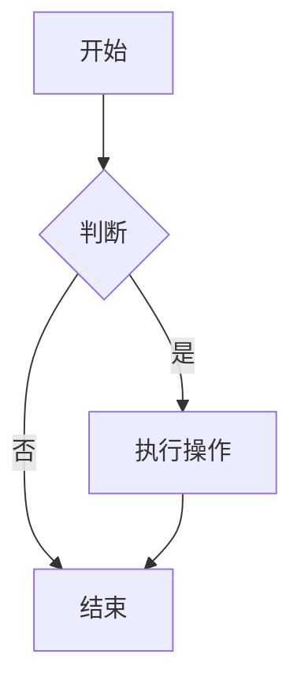

本文用于测试博客主题的 Markdown 渲染样式，涵盖常见语法与边界情况。**建议在正式使用主题前逐项检查。**

---

## 一、标题层级

# H1 一级标题
## H2 二级标题
### H3 三级标题
#### H4 四级标题
##### H5 五级标题
###### H6 六级标题

> 注意：部分主题会为标题自动生成锚点链接，请检查 hover 时是否出现 `#` 图标。

---

## 二、文本样式

普通文本。

**加粗文本**

*斜体文本*

***加粗斜体文本***

~~删除线文本~~

`行内代码`

<u>下划线（HTML）</u>

H~2~O 下标（部分扩展语法）

X^2^ 上标（部分扩展语法）

==高亮文本==（部分扩展语法）

---

## 三、段落与换行

这是第一段。段落之间应保持合理间距。

这是第二段。  
此行通过行尾两个空格实现强制换行。

这是第三段，用于检查段落后紧跟列表时的间距表现。

---

## 四、引用

> 这是一级引用。
>
> > 这是嵌套引用。
>
> 引用中可以包含 **加粗**、*斜体*、`代码`。
>
> —— 引用来源

---

## 五、列表

### 无序列表

- 项目一
- 项目二
  - 嵌套项目 2.1
  - 嵌套项目 2.2
    - 深层嵌套 2.2.1
- 项目三

### 有序列表

1. 第一步
2. 第二步
   1. 子步骤 2.1
   2. 子步骤 2.2
3. 第三步

### 任务列表

- [x] 已完成任务
- [ ] 未完成任务
- [ ] 待办事项

### 混合列表

1. 有序项目
   - 无序子项
   - 无序子项
2. 有序项目

---

## 六、代码

### 行内代码

使用 `console.log('hello')` 输出日志。

### 代码块（无语言）

```
这是一个没有语言标识的代码块。
    缩进内容应保留。
```

### 代码块（带语言）

```javascript
function greet(name) {
  // 注释样式
  const msg = `Hello, ${name}!`;
  return msg;
}

console.log(greet('World'));
```

```python
def fibonacci(n: int) -> list:
    """生成斐波那契数列"""
    a, b = 0, 1
    result = []
    for _ in range(n):
        result.append(a)
        a, b = b, a + b
    return result
```

```css
:root {
  --primary-color: #3b82f6;
  --radius: 8px;
}

.card {
  border-radius: var(--radius);
  box-shadow: 0 2px 8px rgba(0, 0, 0, 0.1);
}
```

```bash
#!/bin/bash
echo "Hello, World!"
npm run build -- --mode production
```

```json
{
  "name": "blog-theme-test",
  "version": "1.0.0",
  "dependencies": {
    "markdown": "^1.0.0"
  }
}
```

### 代码块（超长行，测试横向滚动）

```text
这是一段非常长的文本内容，用来测试代码块在超出容器宽度时是否正确出现横向滚动条，而不是破坏整个页面布局或者溢出容器边界造成页面横向滚动。
```

---

## 七、表格

| 语法 | 说明 | 支持度 |
|------|------|--------|
| 标题 | `#` 至 `######` | ✅ |
| 加粗 | `**text**` | ✅ |
| 斜体 | `*text*` | ✅ |
| 删除线 | `~~text~~` | ⚠️ 部分支持 |

### 对齐方式

| 左对齐 | 居中对齐 | 右对齐 |
|:-------|:--------:|-------:|
| 内容 A | 内容 B | 内容 C |
| 较长内容 AAAA | 较长内容 BBBB | 较长内容 CCCC |
| 1 | 2 | 3 |

### 表格内联格式

| 格式 | 示例 |
|------|------|
| 加粗 | **bold** |
| 代码 | `code` |
| 链接 | [链接](https://example.com) |

---

## 八、链接

[普通链接](https://example.com)

[带标题的链接](https://example.com "鼠标悬停显示")

<https://example.com>

[锚点链接](#一标题层级)

[引用式链接][ref]

[ref]: https://example.com "引用式链接定义"

---

## 九、图片


### 带链接的图片

[](https://example.com)

### 图片说明（部分主题支持）


---

## 十、分隔线

---

***

___

---

## 十一、转义字符

\* 不应变为斜体 \*

\` 不应变为代码 \`

\# 不应变为标题

\\ 反斜杠

---

## 十二、HTML 内联

<div style="padding: 10px; border: 1px solid #ccc; border-radius: 6px;">
  这是一个 HTML 块级元素，用于测试主题对原始 HTML 的处理方式。
</div>

<details>
<summary>点击展开（折叠面板）</summary>

这里是折叠内容，用于测试 `<details>` 标签的样式。

- 列表项
- 列表项

</details>

<br>

键盘按键：<kbd>Ctrl</kbd> + <kbd>C</kbd>

---

## 十三、脚注（部分扩展支持）

这是一个带脚注的句子[^1]。

[^1]: 这是脚注内容，通常显示在文章底部。

---

## 十四、定义列表（部分扩展支持）

术语一
: 术语一的定义说明。

术语二
: 术语二的定义说明。

---

## 十五、数学公式（部分扩展支持）

行内公式：$E = mc^2$

块级公式：

$$
\int_{a}^{b} f(x) \, dx = F(b) - F(a)
$$

---

## 十六、Mermaid 图表（部分扩展支持）



---

## 十七、目录（部分扩展支持）

[TOC]

---

## 十八、特殊字符与边界情况

### 长单词/URL 换行

https://example.com/very/long/path/that/should/wrap/or/scroll/without/breaking/layout/aaaaaaaaaaaaaaaaaaaaaaaaaaaaaaaaaaaa

### 连续标点

你好！！！？？？。。。……

### 空链接

[空链接]()

### 空图片


### 嵌套引用与列表

> - 引用中的列表
> - 第二项
>   1. 嵌套有序
>   2. 嵌套有序

---

## 十九、综合示例

> **提示**：以下是一个综合示例，用于检查多种元素混排时的间距。

1. 首先安装依赖：

   ```bash
   npm install
   ```

2. 然后修改配置文件：

   | 字段 | 值 |
   |------|-----|
   | `theme` | `default` |
   | `darkMode` | `true` |

3. 最后运行：

   ```bash
   npm run dev
   ```

   > 如果端口被占用，可通过 `--port` 指定。

---

## 二十、检查清单

- [ ] 标题层级字体大小、间距、锚点
- [ ] 段落行高与段间距
- [ ] 引用块左边框与背景色
- [ ] 列表缩进与项目符号样式
- [ ] 代码块背景、滚动条、复制按钮
- [ ] 表格边框、斑马纹、横向滚动
- [ ] 链接颜色、hover 下划线
- [ ] 图片最大宽度与居中
- [ ] 分隔线颜色与间距
- [ ] 深色模式下的对比度
- [ ] 移动端响应式布局

---

*文章结束。如果以上所有元素在你的主题中显示正常，说明 Markdown 样式基本完备。*